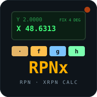

# RPNx



    

**RPNx** is a terminal RPN scientific calculator in the classic Hewlett-Packard
tradition: a live X/Y/Z/T stack, Last X, the full math / trig / log / stats /
base-conversion command set, and a runner for [XRPN](https://github.com/isene/xrpn)
(HP-41 / FOCAL) programs. Part of the [Fe₂O₃](https://github.com/isene/fe2o3)
Rust terminal suite.

<br clear="left"/>

It shares its calculation engine (`fe2o3-rpnx-core`) with the
**[RPNx Android app](https://github.com/isene/nomad/tree/master/apps/rpnx)**, so
the pocket calculator and the terminal one compute — and format numbers —
identically. RPNx is the spiritual successor to the Ruby
[T-REX](https://github.com/isene/T-REX), rebuilt on that shared engine.

## Install

```bash
# Linux x86_64
curl -L https://github.com/isene/rpnx/releases/latest/download/rpnx-linux-x86_64 \
  -o ~/bin/rpnx && chmod +x ~/bin/rpnx
```

Or build from source (needs Rust):

```bash
git clone https://github.com/isene/rpnx && cd rpnx
cargo build --release      # binary at target/release/rpnx
```

## How RPN works

Reverse Polish Notation has no `=` and no parentheses: you push numbers onto a
stack and operators act on what's there. To compute `(3 + 4) × 5`: type `3`,
`ENTER`, `4`, `+` (the stack now holds `7`), then `5`, `*` → `35`. Once it
clicks, it is faster and less error-prone than an algebraic calculator, because
you see every intermediate result in the stack.

The stack is **X** (bottom, the entry line), **Y**, **Z**, **T** (top), with
**L** holding the last X for undo-style recovery.

## Keys

Number entry: digits, `.`, `e` (exponent), `h` (±), `ENTER` to push, `⌫` backspace.

| Group | Keys |
|---|---|
| **stack** | `←` x⇄y · `↑↓` roll · `l` LASTx · `c` clear X · `C` clear stack |
| **arith** | `+` `−` `×` `÷` · `\` mod · `%` percent |
| **power** | `q` √ · `x` 1/x · `^` yˣ · `p` π · `\|` \|x\| · `!` factorial |
| **trig** | `i` sin · `o` cos · `a` tan · `I`/`O`/`A` arc · `r` rad · `d` deg |
| **log** | `n` ln · `g` log |
| **modes** | `f` fix · `s` sci · `'` number format (comma/dot) · `u` undo |
| **regs** | `S` store · `R` recall |

### Cycling shift pages

`TAB` cycles four coloured pages (like the HP f/g shift keys), each overlaying
its functions on the keys while every base key keeps working. `ESC` returns to
base.

| Page | Colour | Functions |
|---|---|---|
| **f** | gold | x² x³ eˣ 10ˣ ˣ√y |
| **g** | blue | Σ+ Σ− mean sd CLΣ int frc drop Δ% |
| **h** | green | eng grad rnd hms hr →P →R |

### Command palette

Press `:` and type any XRPN command by name — every function in the engine,
including the long tail (`sqr`, `cube`, `hms`, `r_p`, `eng`, `sdev`, …). This is
also how you will run and edit XRPN programs.

The stack, registers, flags and display mode persist across sessions in
`~/.config/rpnx/state`.

## In your editor: scribe `=`

[scribe](https://github.com/isene/scribe) (the Fe₂O₃ editor) launches RPNx on
the normal-mode `=` key: do a calculation, quit with `Q`, and the X register is
inserted at the cursor. Any tool can do the same with `rpnx --emit-file <path>`
(RPNx writes X there on a normal quit) or `rpnx --emit-x` (prints X to stdout).

## Pocket version

The **[RPNx Android app](https://github.com/isene/nomad/tree/master/apps/rpnx)**
is the same calculator on your phone — an HP-41-style keypad over the identical
Rust engine, part of the [nomad](https://github.com/isene/nomad) mobile suite.

## License

[Unlicense](https://unlicense.org/) — public domain. Borrow or steal whatever
you want.

— [Geir Isene](https://isene.com)
